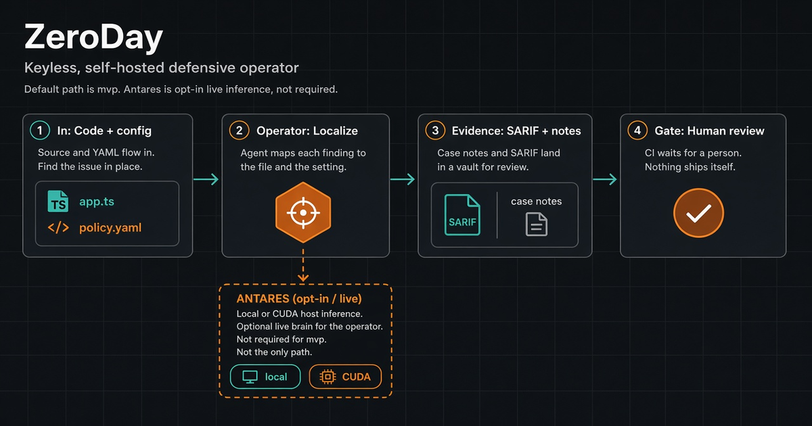
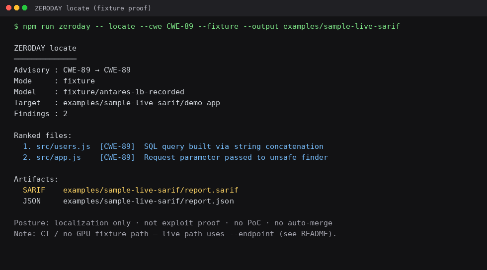
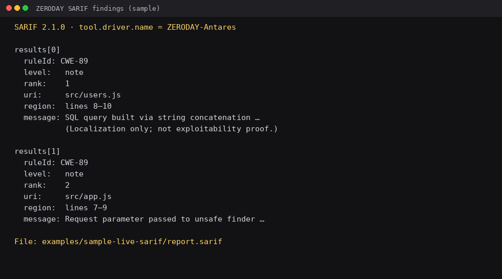
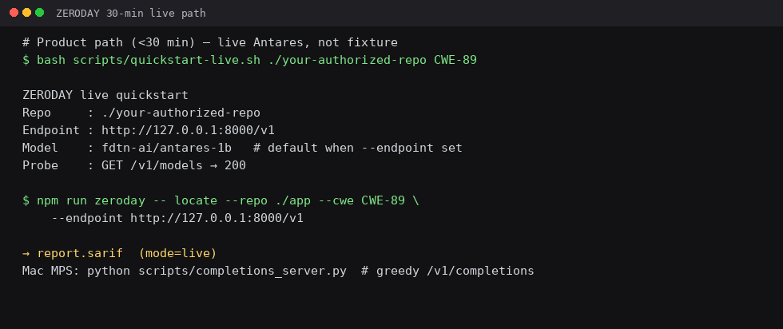

# ZERODAY



Local-first defensive vulnerability **localization** around
[Antares](https://cisco-foundation-ai.github.io/antares/) — keyless fixture /
operate → ranked files + **SARIF** + hashed evidence. **Not a Cisco product.**

> **Hard limits**
>
> - No PoCs, exploits, payloads, or attack procedures — ever (including lab / localhost)
> - Localization ≠ proof of exploitability · `needs_human` always · never auto-merge
> - Default path: **`npm run mvp`** (fixture → SARIF; CI / no-GPU; no HF token)
> - Live Antares is **opt-in** and **costs $** — human accepts HF gated terms + CUDA/vLLM (or documented RunPod Secure A40); ZERODAY never auto-provisions pods
> - Acceptable use / scope: [`SCOPE_AND_AUTHORIZATION.md`](./SCOPE_AND_AUTHORIZATION.md) · disclosure: [`SECURITY.md`](./SECURITY.md)

---

## Why ZERODAY (vs Antares alone)

[Antares](https://blogs.cisco.com/ai/introducing-antares-the-most-efficient-open-weight-ai-models-for-vulnerability-localization)
is a compact localization **brain** — it helps answer “which files?” for a CWE /
advisory. ZERODAY is the daily-driver **workstation + CI habit** around that
brain: keyless stranger path, hashed evidence, Desk commands after locate, and
hard limits as product defaults.

**Not a Cisco product** · not an official Cisco partnership · localization ≠
exploitability. Live Antares weights stay **opt-in** when you already host them.

| Need | Antares | ZERODAY |
|------|---------|---------|
| Morning / stranger path | Model + your own completions host | `npm run mvp` — fixture → SARIF; no GPU / HF token / spend |
| Live Antares when wanted | Direct CLI against your endpoint | Opt-in `locate --endpoint` + doctor; Desk **Live brain** tab (`npm run play`) configures it in seconds — never auto-provisions pods |
| CI/CD early review | You wire inference into CI yourself | Fixture locate + SARIF in Actions without gated weights |
| Privacy / compliance default | Your hosting choice | Local-first keyless default; remote only with explicit ack |
| After localization | Ranked files | Desk on **your** tree (keyless, no Antares): `inventory` → `packet` → `harden` → `classify` → `craft` — not vuln discovery |
| Hand-off to security | Manual packaging | Offline packet / SARIF exporters — generate only, no auto-post |
| Agent / package risk | Out of model scope | `harden` recommend-only (no auto-apply / auto-PR / auto-merge) |
| Crash / noise triage | Out of model scope | `classify` evidence pack; ambiguous → `needs_human` |
| Hard limits productized | Model policy / your process | No PoC · `needs_human` · never auto-merge — baked into CLI, docs, CI |

### Blog workflows → ZERODAY

Cisco’s Antares intro outlines five defensive workflows. Rough map into this
repo (inspired by the open model — **not** a partnership claim):

| Workflow (blog shape) | In ZERODAY |
|-----------------------|------------|
| CWE → files | `locate` / `operate` (fixture default; live Antares opt-in) |
| Advisory triage | CWE / CVE / GHSA → ranked files + hashed evidence |
| Augment SAST | SARIF out for existing review tools |
| CI/CD | `npm run mvp` + fixture factory in Actions |
| Strict privacy | Keyless local-first path; remote only with `--remote-inference` ack |

**Pitch:** Antares = which files. ZERODAY = career-long workstation + CI that
makes Antares usable every day.

---

## How it works

**Same pipeline, different brain.** All doors share one shape: CWE / CVE / GHSA
→ explore (grep / find / cat or thin heuristics) → ranked files + hashed
evidence → SARIF / `report.md`. Keyless does **not** invent a second product —
only the localization brain swaps.

**Four doors** for discovery, plus an org **recording replay** door (Keyless K3)
and an optional **local OpenAI-compatible brain** path for live `--endpoint`
without gated Antares weights (Keyless K4):

1. **Fixture smoke** ([MVP path](#mvp-path-keyless-10-min), `npm run mvp` /
   `locate --fixture`): deterministic recorded brain for CI and strangers — no
   GPU, no HF token, no spend. Proves the workstation + SARIF habit. Output
   `mode: "fixture"`. Honest: this is not live Antares F1; it validates the
   factory shape. **mvp stays fixture smoke** — it does not switch to rules,
   ingest, or org recordings.

2. **Rules on a real repo** (`locate --rules`, $0): thin in-repo CWE heuristics
   (CWE-89 required; CWE-79 / CWE-22 optional) on your authorized `--repo`.
   Explicit flag only — refuses `--fixture`, `--from-sarif`, `--recording`, and
   `--live`/`--endpoint`. Output `mode: "rules"`. Honest: **rules ≠ Antares
   File F1** and ≠ exploitability. No Semgrep binary, no Docker, no HF.

3. **SARIF ingest** (`locate --from-sarif <path.sarif>`, $0): bring an existing
   CodeQL / Semgrep / generic SARIF 2.1 file from disk into the same
   LocalizationResult → evidence → SARIF writers. Optional `--cwe` filters
   mapped findings. Output `mode: "ingest"`. Honest: **third-party findings —
   not Antares/rules discovery**; localization ≠ exploitability. **File path
   only** — no GitHub alerts API / network fetch. No Semgrep binary dependency.

4. **Live completions** ([Live Antares](#live-antares-opt-in-costs-) ·
   [Local brain](#local-openai-compatible-brain-keyless-k4) ·
   [Opt-in live path details](#opt-in-live-path-details), opt-in): same pipeline
   via `--endpoint` at any OpenAI-compatible **`POST /v1/completions`** host.
   **Recommended** brain: Antares-1B (HF gated accept + CUDA/vLLM / RunPod
   Secure A40). **Also allowed:** local Ollama / vLLM / LM Studio without Antares
   weights — still `mode: "live"`, but **arbitrary local models ≠ Antares File
   F1**. Never auto-provisions pods; never scrapes HF; never silent fallback to
   fixture/rules/ingest if the endpoint is down. Completions-only (chat refused).
   Non-loopback still needs `--remote-inference`.

**Org cassette replay** (`record --redact` → `locate --recording`, Keyless K3):
after a real locate (rules / ingest / live / fixture), save a **redacted** org
recording for CI regression — the team's cassette, **not** mvp product fixtures
under `fixtures/locate/recordings/`. `--redact` is default ON and fail-closed.
Replay sets honest `mode: "recording"`. Never auto-commit / auto-PR / upload
cassettes; **a human reviews redaction before commit**.

| | Fixture smoke | Rules (keyless) | SARIF ingest | Live completions | Org recording |
|--|---------------|-----------------|--------------|------------------|---------------|
| Brain | Deterministic fixture | Thin in-repo CWE heuristics | Existing SARIF file | Antares-1B **recommended**; or any local completions host (Ollama/vLLM/LM Studio) | Redacted cassette replay |
| What you need | `npm install` | `npm install` + authorized `--repo` | `npm install` + local `.sarif` | Completions `/v1` you already serve (+ HF/CUDA for Antares) | Prior locate report + human-reviewed cassette |
| Command door | `npm run mvp` / `locate --fixture` | `locate --cwe CWE-89 --repo <path> --rules` | `locate --from-sarif path/to/report.sarif` | `doctor` → `locate --endpoint …` (+ `--remote-inference` if non-loopback) | `record --from <dir> --out c.json` → `locate --recording c.json` |
| SARIF `mode` | `"fixture"` | `"rules"` | `"ingest"` | `"live"` | `"recording"` |
| Cost | $0 | $0 | $0 | Your GPU / local server (you control); Antares path may cost $ | $0 |
| What it proves | Factory shape + SARIF habit | Keyless localize candidates on a real tree | Reuse third-party scanner output in ZERODAY evidence | Live localization on an authorized repo (quality depends on brain) | CI regression of a redacted org localize |

Then the Desk loop (`inventory` → `packet` → `harden` → `classify` → `craft`)
runs **keyless on your tree** (cwd / `--repo` / `--from`) without Antares —
config inventory, offline packets, harden notes, crash classify, defensive
craft. Fixtures stay available via `--fixture` / `npm run mvp` smoke. Desk is
**not** localization / vuln discovery; use `locate --fixture` / mvp for smoke,
`locate --rules` for keyless real-repo localize, `locate --from-sarif` for
scanner ingest, `zeroday doctor` + local `--endpoint` for a completions host
you already run, and Antares-1B when you host the recommended brain.

Hard limits stay: localization ≠ exploitability · **Not a Cisco product** · not
a partnership claim.

[FAQ](./docs/faq.md) — Keyless Strength honesty (fixture vs rules vs ingest vs
recording vs live; Desk without locate; local brain ≠ Antares F1).

---

## MVP path (keyless, &lt;10 min)

**Stranger path:** clone → fixture (or playground) → SARIF. Offline. No GPU. No HF token. No spend.

```bash
git clone https://github.com/pandeyaby/ZERODAY.git && cd ZERODAY
npm install
npm run mvp
# optional Desk Console UI:  npm run play  →  http://localhost:3333/play
#   Commands tab: rules / from-sarif / inventory → packet chain (keyless)
#   Reports & cassettes: browse zeroday-reports/, record/replay org cassettes
#   (redact ON; org regression — not discovery)
#   Live brain (UI-3): preset → save → doctor → spend banner → live locate
#   (opt-in; reuses locate --endpoint + doctor; no auto RunPod)```

Expect **PASS**, then open the printed SARIF paths under `zeroday-reports/mvp/`.

Equivalent: `npm run zeroday -- mvp`

---

## Rules locate (keyless real-repo, $0)

Explicit `--rules` on an authorized local tree — thin in-repo CWE heuristics
(CWE-89 required). Same SARIF / evidence writers as fixture and live. **Not**
Antares File F1; **not** exploitability. Does not change `npm run mvp`
(fixture smoke stays).

```bash
npm run zeroday -- locate --cwe CWE-89 --repo /path/to/authorized/repo --rules
# Sample tree in this repo:
npm run zeroday -- locate --cwe CWE-89 --repo fixtures/locate/rules-sample --rules
```

Refuses mixed doors: `--rules` + `--fixture` or `--live`/`--endpoint` or
`--from-sarif` or `--recording` → fail closed.

---

## SARIF ingest (keyless, $0)

Point ZERODAY at an existing local SARIF 2.1 file (CodeQL / Semgrep / generic).
Same report / evidence / SARIF writers as other doors. **Not** Antares or rules
discovery; **not** exploitability. File path only — no GitHub Code Scanning /
Dependabot / alerts API fetch. Optional `--cwe` keeps only findings mapped to
that CWE.

```bash
npm run zeroday -- locate --from-sarif path/to/codeql.sarif
npm run zeroday -- locate --from-sarif path/to/semgrep.sarif --cwe CWE-89
# Sample in this repo:
npm run zeroday -- locate --from-sarif fixtures/locate/ingest-sample/sample.sarif --cwe CWE-89
```

Refuses mixed doors: `--from-sarif` + `--fixture` / `--rules` / `--recording` /
`--live` / `--endpoint` → fail closed. Does not change `npm run mvp` (fixture
smoke stays).

---

## Org CI cassettes (`record --redact`, Keyless K3)

After a real locate (rules / ingest / live / fixture), save a **redacted** org
recording for CI regression. These are the **team's cassettes** — not mvp
product fixtures in `fixtures/locate/recordings/`. Org cassettes = **org
regression, not discovery**.

```bash
# 1. Locate (example: rules on sample tree)
npm run zeroday -- locate --cwe CWE-89 --repo fixtures/locate/rules-sample --rules \
  --output zeroday-reports/org-locate

# 2. Record — --redact default ON (fail-closed; refuses incomplete / empty rankedFiles)
npm run zeroday -- record --from zeroday-reports/org-locate \
  --out fixtures/locate/org-recordings/rules-cwe-89.cassette.json

# 3. Human reviews the cassette (paths relative? secrets stripped?) before commit

# 4. Replay offline
npm run zeroday -- locate --recording fixtures/locate/org-recordings/rules-cwe-89.cassette.json
```

Same flow from Desk Console (`npm run play` → **Reports & cassettes**): pick a
locate reports dir → Record (redact ON; UI refuses `--no-redact`) → Replay →
results show `mode: "recording"`. Path sandbox matches Desk commands.
(UI-2 “No live Antares” meant that validate path didn’t exercise spend — live
CLI already existed; see **Live brain** below for the first-class UI.)

Hard locks: absolute paths → repo-relative; secret-shaped strings stripped;
refuse write if redaction fail-closed; **no auto-commit / auto-PR / network
exfil**; localization ≠ exploitability. See
[`fixtures/locate/org-recordings/README.md`](./fixtures/locate/org-recordings/README.md).

---

## Live brain from Desk Console (UI-3)

Configure live Antares (or any local OpenAI-compatible completions host) in
seconds from `/play` — first-class UI, not a CLI scavenger hunt. Keyless stays
default; live is opt-in with an explicit human click and spend banner.

```bash
npm run play
# → http://localhost:3333/play → Live brain tab
#    1) Pick preset: Antares-1B (HF gated — accept terms yourself),
#       optional Antares-350M (Ollama), or local OpenAI-compatible
#    2) Save → .zeroday/desk-endpoint.json (token env *name* only; never the secret)
#    3) Doctor ping → K4 checklist + /v1/models probe
#    4) Spend banner confirm → live locate (reuses --endpoint / live-guard)
# Non-loopback: check remote-inference ACK (maps to --remote-inference)
```

No auto RunPod / auto-spend. Completions-only (chat refused). Same path sandbox
as Desk Commands (`ZERODAY_UI_ROOTS`). Optional Antares-350M via Ollama (import
yourself; no auto-download; no F1 claim):
[`docs/antares-350m-ollama.md`](./docs/antares-350m-ollama.md). Details:
[`docs/getting-started.md`](./docs/getting-started.md) ·
[`docs/local-brain.md`](./docs/local-brain.md).

---

## Local OpenAI-compatible brain (Keyless K4)

LAST Keyless Strength slice. Point `locate --endpoint` at **any** local
OpenAI-compatible **`POST /v1/completions`** host you already run (Ollama,
local vLLM, LM Studio, …) — **no gated Antares weights required**. Still
`mode: "live"`. **No new locate modes.**

```bash
# Print-only checklist ($0 — no download, no auto-start, no RunPod)
npm run zeroday -- doctor
# same: bash scripts/local-brain-doctor.sh --print-only

# Shape-only check (no network) — chat URLs fail closed:
npm run zeroday -- doctor --endpoint http://127.0.0.1:8000/v1

# After YOU start a completions server on loopback:
npm run zeroday -- locate --cwe CWE-89 --repo <authorized-repo> \
  --endpoint http://127.0.0.1:8000/v1 --model <your-model-id>
```

Hard locks: completions-only (chat refused) · non-loopback still needs
`--remote-inference` · **arbitrary local models ≠ Antares File F1** · Antares-1B
remains the **recommended** live brain when HF+CUDA available · print-only
doctor never downloads models or starts servers.

One-pager: [`docs/local-brain.md`](./docs/local-brain.md) · recommended Antares
path: `npm run zeroday -- antares doctor` · [`docs/runpod-antares.md`](./docs/runpod-antares.md)

---

## Live Antares (opt-in, costs $)

Not the default. Requires a human to accept HF gated terms for
`fdtn-ai/antares-1b`, serve completions (CUDA / vLLM), and **terminate the pod
after use**. ZERODAY never scrapes HF terms, never downloads `model.safetensors`
in CI, and **never creates paid RunPod pods**. For a local completions host
**without** Antares weights, use [`doctor` / local-brain](#local-openai-compatible-brain-keyless-k4) first.

```bash
# Print-only checklist (no spend) — Secure A40 recipe + HF gate + terminate-after-use
npm run zeroday -- antares doctor
# same: bash scripts/runpod-vllm-antares.sh --print-only

# After YOU provision a Secure A40 and serve vLLM (see docs/runpod-antares.md):
export ZERODAY_REMOTE_INFERENCE_ACK=1   # required — may send prompts/repo context
npm run zeroday -- locate --cwe CWE-89 --repo <authorized-repo> \
  --endpoint https://<pod-id>-8000.proxy.runpod.net/v1 \
  --model fdtn-ai/antares-1b --remote-inference
# Then stop/terminate the pod — do not leave it RUNNING.
```

Full one-pager: [`docs/runpod-antares.md`](./docs/runpod-antares.md) · host-agnostic: [`docs/remote-antares-vllm.md`](./docs/remote-antares-vllm.md) · local any-completions: [`docs/local-brain.md`](./docs/local-brain.md)

---

## Proof (fixture-shaped sample)

Open without a GPU — same SARIF schema as live; `mode` differs (`fixture` vs `live`).

```bash
npm run mvp                                  # regenerates under zeroday-reports/mvp/
bash scripts/demo-proof.sh                   # refreshes examples/sample-live-sarif/
```

**(a) Sample SARIF** ([full](./examples/sample-live-sarif/report.sarif) · [excerpt](./examples/sample-live-sarif/report.excerpt.sarif.json)):

```json
{
  "version": "2.1.0",
  "runs": [{
    "tool": { "driver": { "name": "ZERODAY-Antares" } },
    "results": [{
      "ruleId": "CWE-89",
      "level": "note",
      "message": {
        "text": "SQL query built via string concatenation — rank 1. … (Localization only; not exploitability proof.)"
      },
      "locations": [{
        "physicalLocation": {
          "artifactLocation": { "uri": "src/users.js", "uriBaseId": "%SRCROOT%" },
          "region": { "startLine": 8, "endLine": 10 }
        }
      }],
      "properties": { "submission_rank": 1, "mode": "fixture" }
    }]
  }]
}
```

**(b) Screenshots**







---

## Default path details (same door as MVP)

`npm run mvp` runs fixture **locate** + keyless **operate→verify**. Manual equivalents:

```bash
npm run zeroday -- locate --cwe CWE-89 --fixture --output zeroday-reports/ci-smoke
npm run zeroday -- operate --cwe CWE-89 --fixture --output zeroday-reports/demo-operate
npm run zeroday -- verify --from zeroday-reports/demo-operate
```

Factory loop (CI-safe, optional):

```bash
npm run zeroday -- factory run --cwe CWE-89 --fixture --defend \
  --output zeroday-reports/factory-demo
npm run zeroday -- verify --from zeroday-reports/factory-demo
```

Multi-repo / config inventory (Desk B — **your tree by default**; still keyless;
**not** vuln discovery):

```bash
# Real path (default): inventory the current working directory
npm run zeroday -- inventory
# Or an authorized repo:
npm run zeroday -- inventory --repo /path/to/authorized-repo \
  --output zeroday-reports/inventory

# Fixture smoke only (CI / stranger — same as before):
npm run zeroday -- inventory --fixture \
  --output zeroday-reports/desk-b-inventory
```

Stranger summary (Desk on a real tree):

- Scans **your** cwd / `--repo` for Actions / Docker / manifests / agent-skill surfaces
- Records CI secret *patterns* (names only), `.env.example` honesty, dependency/agent harness hints
- Emits `inventory.json` + `inventory.md` + redacted SARIF + case note under `zeroday-reports/`
- **No** live Antares/RunPod · **no** PoC · Desk ≠ localize (use `locate` / `operate` for that)
- `npm run mvp` + `inventory --fixture` remain the fixture smoke door

Docs: [`docs/defense-factory.md`](./docs/defense-factory.md) · [`docs/reports/`](./docs/reports/) · [`fixtures/inventory/desk-b/`](./fixtures/inventory/desk-b/) · real-shaped sample: [`fixtures/inventory/real-shaped/`](./fixtures/inventory/real-shaped/)

Security packet (Desk A — offline share; generate only, **no auto-post**):

```bash
# After inventory → prefers zeroday-reports/, else docs/reports if present; else require --from
npm run zeroday -- packet
npm run zeroday -- packet --from zeroday-reports/inventory
# Fixture smoke:
npm run zeroday -- packet --fixture
```

- Consumes inventory JSON + SARIF (does not re-inventory)
- Emits `summary.md`, classified findings, SARIF copy, module/PR/ticket placeholders
- Labels: `agent-misfire` / `config` / `dependency` / `unknown` — evidence-backed only (no guessing)
- Sample: [`docs/reports/desk-a-packet/`](./docs/reports/desk-a-packet/)

Agent/package harden (Desk C — recommend-only; **no auto-apply / auto-PR / auto-merge**):

```bash
npm run zeroday -- harden
npm run zeroday -- harden --from zeroday-reports/security-packet --draft
# Fixture smoke:
npm run zeroday -- harden --fixture
```

- Consumes inventory + packet outputs (does not re-scan private clones)
- Emits `harden.md` + `harden.json`; `--draft` adds human-gated notes under `drafts/`
- Evidence-backed: agent harness · package scripts/deps · secrets hygiene · config surfaces
- Sample: [`docs/reports/desk-c-harden/`](./docs/reports/desk-c-harden/)

Crash classify + evidence (Desk E — **human review · no auto-remediate**):

```bash
# Prefers zeroday-reports/ (or docs/reports) when present; else --from / --fixture / --scenario
npm run zeroday -- classify --from zeroday-reports/<locate-or-classify-dir>
npm run zeroday -- classify --fixture
```

- Labels: `possible_breach` | `infra_failure` | `software_defect` | `agent_misfire` | `needs_human`
- Ambiguous → **`needs_human`**; never invent breach from weak signals
- **Classification ≠ exploitability** · Desk ≠ vuln discovery
- Sample: [`docs/reports/desk-e-classify/`](./docs/reports/desk-e-classify/)

Defensive plugins/skills craft (Desk D — LAST; generate-only; **no auto-install / marketplace**):

```bash
npm run zeroday -- craft
npm run zeroday -- craft --from zeroday-reports
# Fixture smoke:
npm run zeroday -- craft --fixture
npm run zeroday -- skill --fixture
npm run zeroday -- plugin --fixture
```

- Consumes Desk B→A→C→E reports as pattern input (does not re-scan)
- Emits Cursor/Grok-style `SKILL.md` + plugin stub encoding inventory→packet→harden→classify
- **Refuses** exploits, PoCs, and offensive skill patterns
- Sample: [`docs/reports/desk-d-craft/`](./docs/reports/desk-d-craft/)

**Honesty:** Desk keyless on *your* tree does **not** replace localization. Fixture
`locate` / `npm run mvp` still smoke the factory; `locate --rules` is keyless
real-repo localize; `locate --from-sarif` reuses scanner SARIF; live Antares is
the opt-in GPU brain.
---

## Opt-in live path details

Real local or remote CUDA inference — **not** the default demo.

### 1) Install (Node + Antares CLI)

```bash
git clone https://github.com/pandeyaby/ZERODAY.git && cd ZERODAY
npm install
uv tool install cisco-antares-cli
export PATH="$(uv tool dir --bin):$PATH"
antares --version
```

### 2) Accept Hugging Face license (human step)

→ [https://huggingface.co/fdtn-ai/antares-1b](https://huggingface.co/fdtn-ai/antares-1b)

Never scrape or bypass. ZERODAY never downloads `model.safetensors` for you.

### 3) Serve completions (CUDA / RunPod preferred)

Antares CLI expects **`POST /v1/completions`** (chat rejected). Prefer vLLM on CUDA.

```bash
# Recommended remote: Secure A40 — docs/runpod-antares.md
# On the pod:
vllm serve fdtn-ai/antares-1b --host 0.0.0.0 --port 8000 --max-model-len 32768

# Mac Apple Silicon (MPS) — UNSUPPORTED for schema-faithful live locate.
# float16 → NaN bangs; float32 stops bangs but tool_call JSON is often malformed.
# Helper for bang-safe local smoke only:
python scripts/completions_server.py --model fdtn-ai/antares-1b --port 8000
```

Model defaults to `fdtn-ai/antares-1b` with `--endpoint` / `--live` (override with `--model` / `ANTARES_MODEL`).

### 4) Locate → SARIF

```bash
npm run zeroday -- locate \
  --repo /path/to/your/authorized/repo \
  --cwe CWE-89 \
  --endpoint http://127.0.0.1:8000/v1

bash scripts/quickstart-live.sh /path/to/your/authorized/repo CWE-89
```

| File | What |
|------|------|
| `report.sarif` | SARIF 2.1.0 |
| `report.json` | Ranked files (`mode: "live"`) |
| `report.md` | CISO one-pager |
| `comment.md` | PR comment body |

**Invariant:** live + down endpoint → non-zero exit (no silent fixture fallback).

**Incomplete runs:** no invented findings. Defaults: `--tool-budget 30`, best-effort re-query, `--fail-on-incomplete` (exit 2). Prefer **vLLM/CUDA**; MPS float32 is bang-safe but tool-schema unreliable — ZERODAY does not rewrite malformed tool_call JSON.

| Class | Meaning |
|-------|---------|
| `no_submit` | Model stopped without `submit_*` |
| `budget_exhausted` | Tool budget used up |
| `timeout` | Deadline hit |
| `endpoint_error` | Completions failed |
| `parse_failure` | No usable `report.json` |

Tips: `GET /v1/models` + smoke `POST /v1/completions`; `--tool-budget 45`; `--no-live-recovery` / `--no-fail-on-incomplete` as needed.

Sister pieces: [Antares](https://cisco-foundation-ai.github.io/antares/) · [cookbook Quickstart](https://github.com/cisco-foundation-ai/cookbook/blob/main/1_quickstarts/Quickstart_Antares.md) · [Foundry](https://github.com/CiscoDevNet/foundry) · [CodeGuard](https://project-codeguard.org/)

---

## What works offline vs live

| Path | Needs | Writes SARIF? |
|------|-------|---------------|
| **`npm run mvp`** / **`locate --fixture`** | No GPU / no HF | Yes — **default smoke** |
| **`locate --rules`** | No GPU / no HF + authorized `--repo` | Yes — keyless real-repo heuristics |
| **`locate --from-sarif`** | No GPU / no HF + local `.sarif` | Yes — third-party ingest (mode=ingest) |
| **`record` → `locate --recording`** | Prior locate report (offline) | Yes — redacted org cassette replay (mode=recording) |
| **`operate`** (keyless) | Coding agent + snapshot | Yes (after submission / `--fixture`) |
| **`locate --endpoint …`** (live) | Completions `/v1` you serve (Antares-1B recommended; any local host ok) | Yes — **opt-in**; quality ≠ Antares F1 unless Antares |
| **`doctor`** (local-brain) | Nothing | No — print-only checklist ($0) |
| **`antares doctor`** | Nothing | No — print-only Antares/RunPod checklist |

---

## GitHub Action

On `pull_request`: fixture locate → upload SARIF → reviewable PR comment (fail-closed). Never pulls weights. Never auto-merge.

Workflow: [`.github/workflows/zeroday-locate.yml`](./.github/workflows/zeroday-locate.yml)

---

## Honesty

- **Keyless default** — `npm run mvp`; customer source stays local unless `--remote-inference` / `ZERODAY_REMOTE_INFERENCE_ACK`
- **No partnership claims** — not an official Cisco / Splunk / Palo / Fortinet / CrowdStrike / AWS / RunPod product
- **Localization ≠ exploitability** — candidates only; `needs_human` always
- **No PoCs / exploits / payloads / attack procedures**
- **Never auto-merge** — drafts only after `--i-asked-for-a-fix`
- **No silent fixture fallback** on the live path
- **No silent spend** — print-only `doctor` / `antares doctor` / RunPod scaffold; you provision and terminate
- **Local brain honesty** — arbitrary Ollama/vLLM/LM Studio models ≠ Antares File F1; Antares-1B remains recommended when HF+CUDA available

Full Q&A: [`docs/faq.md`](./docs/faq.md) · also in the play UI FAQ tab (`npm run play` → Desk Console home; FAQ is a tab).

[`SCOPE_AND_AUTHORIZATION.md`](./SCOPE_AND_AUTHORIZATION.md) · [`SECURITY.md`](./SECURITY.md)

---

## Vendor packs (local files only)

| Desk | File |
|------|------|
| Cisco / Code Scanning | `report.sarif` |
| Splunk | `splunk-cim-vulnerabilities.json` |
| Palo Alto | `xsoar-incidents.json` |
| Fortinet | `fortisiem-custom.json` |
| CrowdStrike | `crowdstrike-hec-events.ndjson` |
| AWS Security | `asff-findings.json` |

Inventory desk (cwd / `--repo` by default; `--fixture` for smoke): `npm run zeroday -- inventory` · security packet: `npm run zeroday -- packet` · harden: `npm run zeroday -- harden` · classify: `npm run zeroday -- classify --fixture` · craft: `npm run zeroday -- craft` · reports: [`docs/reports/`](./docs/reports/) · [`docs/defense-factory.md`](./docs/defense-factory.md)

[`docs/vendor-packs/README.md`](./docs/vendor-packs/README.md) · [`docs/antares.md`](./docs/antares.md) · [`docs/agent-operator.md`](./docs/agent-operator.md)

---

## CLI cheat sheet

```bash
# MVP door (keyless fixture smoke — locate + operate→verify)
npm run mvp

# Rules locate on a real authorized repo ($0 — not Antares F1)
npm run zeroday -- locate --cwe CWE-89 --repo /path/to/repo --rules

# SARIF ingest (local file only — mode=ingest)
npm run zeroday -- locate --from-sarif path/to/report.sarif --cwe CWE-89

# Org CI cassette (Keyless K3 — redacted; human reviews before commit)
npm run zeroday -- record --from zeroday-reports/org-locate --out cassette.json
npm run zeroday -- locate --recording cassette.json

# Desk on your tree (keyless, no Antares — not vuln discovery)
npm run zeroday -- inventory
npm run zeroday -- packet
npm run zeroday -- harden
npm run zeroday -- classify --from <reports-or-locate-dir>
npm run zeroday -- craft

# Desk fixture smoke (CI / stranger)
npm run zeroday -- inventory --fixture
npm run zeroday -- packet --fixture
npm run zeroday -- harden --fixture
npm run zeroday -- classify --fixture
npm run zeroday -- craft --fixture

# Opt-in local completions brain (Keyless K4 — print-only first; $0)
npm run zeroday -- doctor
# bash scripts/local-brain-doctor.sh --print-only
# npm run zeroday -- locate --endpoint http://127.0.0.1:8000/v1 --model <id> …

# Opt-in live Antares localize (costs $) — print-only first
npm run zeroday -- antares doctor
bash scripts/quickstart-live.sh ./app CWE-89

# Other
npm run zeroday -- factory run --cwe CWE-89 --fixture --defend
npm run zeroday -- classify --scenario possible_breach
npm run zeroday -- demo
npm run operator   # local Desk Console / Operator UI on :3333
npm test           # full suite (includes Desk UI-2 reports + UI-3 live-endpoint)
npm run test:desk  # Desk unit tests only (path-policy + reports + live-endpoint)
```

Desk unit tests cover **UI-2** reports/cassettes and **UI-3** live-endpoint (Mac-safe PathPolicy under `os.tmpdir()`). CI runs them via the `desk-ui` job and via `npm test` in the locate gate.
---

## License & credits

**Apache-2.0** — see [`LICENSE`](./LICENSE) (`SPDX-License-Identifier: Apache-2.0`).
Authorized / defensive use only ([`SCOPE_AND_AUTHORIZATION.md`](./SCOPE_AND_AUTHORIZATION.md)). No warranty.

- **Antares** — [site](https://cisco-foundation-ai.github.io/antares/) · [Quickstart](https://github.com/cisco-foundation-ai/cookbook/blob/main/1_quickstarts/Quickstart_Antares.md) · [HF `fdtn-ai/antares-1b`](https://huggingface.co/fdtn-ai/antares-1b) · [`cisco-antares-cli`](https://pypi.org/project/cisco-antares-cli/)
- Foundry Security Spec · Project CodeGuard — compose, don’t replace
