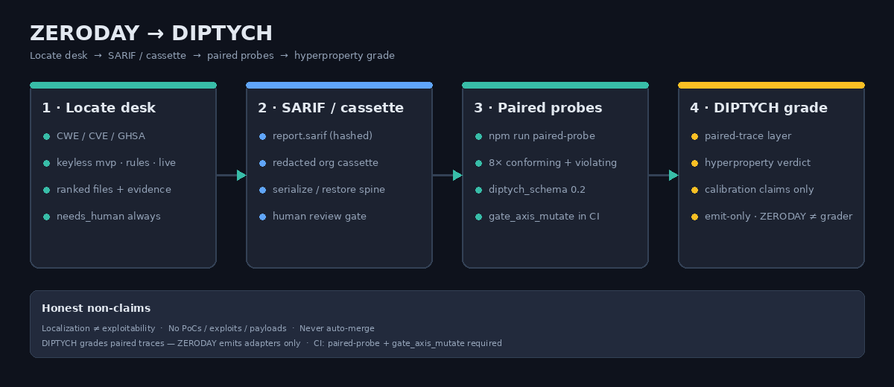
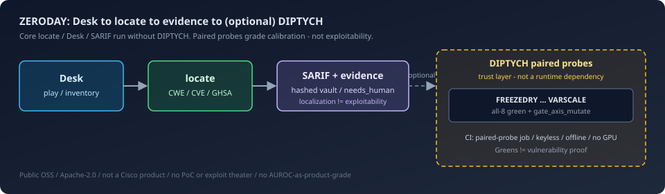

# ZERODAY

[](https://github.com/pandeyaby/ZERODAY/actions/workflows/zeroday-locate.yml)
 · [CI trust — `paired-probe` all-8 + `gate_axis_mutate`](./docs/ci-trust.md)
 · [](https://codespaces.new/pandeyaby/ZERODAY)


**Public OSS · Apache-2.0 · not a Cisco product.**  
Local-first defensive **localization** desk: given a CWE / CVE / GHSA you are
authorized to assess, rank which files matter, then emit **SARIF** + hashed
evidence for a human to review — never auto-merge, never exploit theater.

Built around [Antares](https://cisco-foundation-ai.github.io/antares/) as an
optional live brain. Calibration claims for paired-trace / hyperproperty grading
go through the emit-only adapters into
**[DIPTYCH](https://github.com/pandeyaby/DIPTYCH)** (paired probes already on
`main`; ZERODAY does not implement DIPTYCH’s grader).

> **Hard limits** (unchanged product rules)
>
> - No PoCs, exploits, payloads, or attack procedures — ever (no exploit theater)
> - Localization ≠ proof of exploitability · `needs_human` always · never auto-merge
> - Default is keyless (`npm run mvp`) — no GPU, no HF token, no spend
> - Live Antares is **opt-in** and **costs $** — you accept HF terms and host
>   completions yourself; ZERODAY never auto-provisions pods
> - This repo is public; **customer source stays private** unless you explicitly
>   ACK remote inference (`--remote-inference`)
> - No AUROC-as-product-grade claims · DIPTYCH greens ≠ vulnerability proof
> - Scope: [`SCOPE_AND_AUTHORIZATION.md`](./SCOPE_AND_AUTHORIZATION.md) ·
>   disclosure: [`SECURITY.md`](./SECURITY.md) · help: [`SUPPORT.md`](./SUPPORT.md)



**Pipeline (honest):** locate desk → SARIF / redacted cassette →
`paired-probe` conforming+violating twins →
[DIPTYCH](https://github.com/pandeyaby/DIPTYCH) grades hyperproperties.
CI requires **`paired-probe` + `gate_axis_mutate`** (all 8 operators green or
honestly deferred — never cosmetic greens). Details:
[`docs/paired-probes.md`](./docs/paired-probes.md) ·
[`docs/architecture.md`](./docs/architecture.md).

**Design-partner door (no DIPTYCH clone):** `npm run paired-probe` then
`npm run paired-probe:sample-report` → checked-in sample grade under
[`docs/reports/diptych-sample-grade.md`](./docs/reports/diptych-sample-grade.md)
(illustrative DIPTYCH-shaped mirror — not a live harness claim; greens =
hyperproperty adapters; localization ≠ exploitability).

**One-command from an existing locate SARIF / vault:**  
`npm run paired-probe:from-sarif -- --sarif path/to/report.sarif` → same
envelopes + coverage matrix (keyless, no GPU, no DIPTYCH clone). Pipeline:
locate → SARIF → this command → optional DIPTYCH grade. Details:
[`docs/paired-probes.md`](./docs/paired-probes.md).

### Stranger trust loop (≤3 commands)

After locate, the design-partner path from Desk / CLI to paired-probe artifacts
+ a checked-in sample DIPTYCH-shaped grade — **no DIPTYCH clone**, no GPU:

```bash
npm run mvp                                                      # 1 · fixture locate → SARIF
npm run paired-probe:from-sarif -- --sarif zeroday-reports/mvp   # 2 · envelopes + matrix
# 3 · open sample grade (illustrative): docs/reports/diptych-sample-grade.md
```

One-shot (same story, prints paths): `npm run trust-loop`  
(or `npm run trust-loop -- --mvp` to run fixture locate first).

Honest non-claims: localization ≠ exploitability · no AUROC · DIPTYCH grades ·
ZeroDay emits · sample grade is illustrative (not a live DIPTYCH harness run).
See [`docs/paired-probes.md`](./docs/paired-probes.md) ·
[`docs/design-partner-trust.md`](./docs/design-partner-trust.md) ·
[`SUPPORT.md`](./SUPPORT.md).

---

## Two doors (honest labels)

| Door | What it is | Spend / CI |
|------|------------|------------|
| **A — Keyless CPU / fixture** (default) | `npm run mvp` · fixture / rules / SARIF ingest / recordings | **$0** · required CI gate — no GPU, no HF, no RunPod |
| **B — Opt-in live GPU brain** | You host Antares-1B on CUDA/vLLM (`POST /v1/completions`); RunPod Secure A40 recommended | **You** provision + terminate · **not** in CI |

Proven vs deferred (design-partner table): [`docs/gpu-claims.md`](./docs/gpu-claims.md).
Paired-eval trust layer (optional, keyless): [DIPTYCH](https://github.com/pandeyaby/DIPTYCH) ·
[`docs/paired-probes.md`](./docs/paired-probes.md).

### What a stranger can verify today

One keyless command — no GPU spend, no pod create:

```bash
npm install
npm run stranger:verify
# alias: npm run doors
```

**Clone-free (GitHub Codespaces):** open this repo in a Codespace (Node LTS +
`npm install` via [`.devcontainer/`](./.devcontainer/devcontainer.json)) —
no local Node setup.

1. [Open in GitHub Codespaces](https://codespaces.new/pandeyaby/ZERODAY) (create codespace)
2. In the terminal: `npm run stranger:verify` (or `npm run doors`)
3. See **Door A PASS** + **Door B citation** (no GPU in the default Codespace)

| Door | What happens | Where to read |
|------|--------------|---------------|
| **A — Keyless** | Runs `trust-loop` (fixture SARIF → paired-probe) · prints **PASS** + artifact paths | [`docs/ci-trust.md`](./docs/ci-trust.md) · [`docs/stranger-verify.md`](./docs/stranger-verify.md) |
| **B — Live GPU** | **Not run** — cites dated Secure A40 re-proof only (pod `d65ny3xqf7bwza`, ~$0.034, models/completions 200, locate → `src/users.js`) | [`docs/gpu-claims.md`](./docs/gpu-claims.md) § Live re-proof (2026-09-19) |

Same keyless command is a CI job (`stranger-verify`) on the locate workflow badge above — Door B stays citation-only (no GPU in Actions or the default Codespace).

**Other repos (reusable workflow):**  
`uses: pandeyaby/ZERODAY/.github/workflows/stranger-verify.yml@main` — checks out ZERODAY fixtures/scripts (not your private tree). Snippet: [`docs/stranger-verify.md`](./docs/stranger-verify.md).

Honest non-claims: localization ≠ exploitability · CI badge ≠ vuln proof · no AUROC · Codespace ≠ live Antares · DIPTYCH grades separately · sample grade illustrative.

**Day-1 water-flow (clone → mvp → trust-loop → stranger:verify → optional Door B cite):**
[`docs/design-partner-day1.md`](./docs/design-partner-day1.md).

---

## Start in 2 minutes — Door A (keyless)

Clone, install, run the fixture smoke. Offline. No GPU. No HF token. No spend.

```bash
git clone https://github.com/pandeyaby/ZERODAY.git && cd ZERODAY
npm install
npm run mvp
```

Expect **PASS**, then open the printed SARIF under `zeroday-reports/mvp/`
(`report.sarif`). Same door as `locate --fixture` — proves the workstation +
SARIF habit. Honest: this is not live Antares File F1; it validates the factory
shape.

More stranger detail: [`docs/getting-started.md`](./docs/getting-started.md) ·
[`docs/first-time-users.md`](./docs/first-time-users.md)

---

## Desk Console

Want a browser UI on the same keyless path?

```bash
npm run play
# → http://localhost:3333/play
```

One screen for fixture smoke, rules / SARIF ingest commands, Desk
`inventory → packet → harden → classify → craft`, reports & cassettes, the
**Prove doors** tab (**Run** → `POST /api/stranger-verify`; optional
`{ "liveUrl" }` probe; same `--json` shape as CLI; CLI copy secondary + Door B
citation to
[`docs/gpu-claims.md`](./docs/gpu-claims.md) § Live re-proof — no GPU spend /
`provisioned: false`; see [`docs/stranger-verify.md`](./docs/stranger-verify.md)),
FAQ, and the opt-in **Live brain** tab (including
**Validate live (≤60s)** when you already have a completions host). Desk runs on
**your** tree without Antares — it is not vuln discovery. Deeper walkthrough:
[`docs/howto.md`](./docs/howto.md) · [`docs/stranger-verify.md`](./docs/stranger-verify.md) ·
[`docs/getting-started.md`](./docs/getting-started.md)

### Watch the Desk

No clone required — play inline on github.com from the release CDN.

GitHub’s file browser can’t preview large videos — play from this README or the
[`desk-demos` release](https://github.com/pandeyaby/ZERODAY/releases/tag/desk-demos).

<video src="https://github.com/pandeyaby/ZERODAY/releases/download/desk-demos/desk-console-keyless-demo.webm" controls width="100%" poster="./artifacts/desk-ui-demo/04-locate-result.png">
  <a href="https://github.com/pandeyaby/ZERODAY/releases/download/desk-demos/desk-console-keyless-demo.webm">Keyless Desk demo</a>
</video>

<video src="https://github.com/pandeyaby/ZERODAY/releases/download/desk-demos/desk-console-live-antares-demo.webm" controls width="100%" poster="./artifacts/desk-ui-demo/live-06-locate-result.png">
  <a href="https://github.com/pandeyaby/ZERODAY/releases/download/desk-demos/desk-console-live-antares-demo.webm">Live Antares Desk demo</a>
</video>

[Open keyless demo](https://github.com/pandeyaby/ZERODAY/releases/download/desk-demos/desk-console-keyless-demo.webm) ·
[Open live Antares demo](https://github.com/pandeyaby/ZERODAY/releases/download/desk-demos/desk-console-live-antares-demo.webm)

Keyless = `$0` fixture path; live clip = opt-in completions host you run (not Cisco hosting); localization only — no PoC. Re-record notes: [`artifacts/desk-ui-demo/README.md`](./artifacts/desk-ui-demo/README.md).

---

## How it works

**Same pipeline, different brain.** Every locate door shares one shape:

CWE / CVE / GHSA → explore → ranked files + hashed evidence → SARIF / `report.md`



| | Antares (brain) | ZERODAY (desk) | DIPTYCH (grade) |
|--|-----------------|----------------|-----------------|
| Job | “Which files?” for a CWE / advisory | Workstation + CI habit around that answer | Paired-trace / hyperproperty grading of calibration claims |
| Morning path | Model + your completions host | `npm run mvp` — fixture → SARIF; $0 | Consumes ZERODAY probe pairs (emit-only adapters on `main`) |
| After locate | Ranked files | Desk on your tree, exporters, human gate · optional `paired-probe` | Grades conforming vs violating twins — not exploit proof |
| Live weights | You host them | Opt-in `--endpoint` / Desk **Live brain**; never auto-provisions pods | Offline / CI — no GPU required for ZERODAY emit |

Keyless does not invent a second product — only the localization brain swaps
(fixture · rules · SARIF ingest · live · org recording). Full door map:
[`docs/paths.md`](./docs/paths.md). Honesty Q&A: [`docs/faq.md`](./docs/faq.md)
(also a tab in `npm run play`).

**Calibration layer:** ZERODAY emits `diptych_schema` 0.2 probe pairs; grading
lives in [DIPTYCH](https://github.com/pandeyaby/DIPTYCH). A Desk `/play` session
does **not** prove FREEZEDRY bit-reproducibility or full hyperproperty coverage —
CI `paired-probe` + `gate_axis_mutate` does. See
[`docs/paired-probes.md`](./docs/paired-probes.md).

---

## DIPTYCH (optional paired-eval / trust layer)

[**DIPTYCH**](https://github.com/pandeyaby/DIPTYCH) grades calibration as
**2-safety hyperproperties** on ZERODAY locate artifacts (FREEZEDRY…VARSCALE +
`gate_axis_mutate`).

**DIPTYCH is optional.** It is paired-probe / trust tooling — not a runtime
dependency. Core `locate`, Desk, and SARIF work without it.

- Emit locally (keyless / offline, no GPU): `npm run paired-probe`
- Docs: [`docs/paired-probes.md`](./docs/paired-probes.md)
- Required on `main`: the `paired-probe` job in
  [`.github/workflows/zeroday-locate.yml`](./.github/workflows/zeroday-locate.yml)
  (badge above) keeps all-8 green + `gate_axis_mutate` after #41/#42. CI is
  keyless / offline — **no GPU** in this gate.

**Honest non-claim:** DIPTYCH greens grade probe calibration. They are **not**
vulnerability proof, exploit confirmation, or AUROC-as-product-grade marketing.

---

## Design partners / trust

One trust surface for strangers and design partners — same story as
[`docs/design-partner-trust.md`](./docs/design-partner-trust.md):

| Need | Where |
|------|--------|
| Acceptable use / authorization | [`SCOPE_AND_AUTHORIZATION.md`](./SCOPE_AND_AUTHORIZATION.md) |
| Product hard limits + reporting a ZERODAY defect | [`SECURITY.md`](./SECURITY.md) |
| How to get help (no SLA; not Cisco support) | [`SUPPORT.md`](./SUPPORT.md) |
| Day-1 checklist (water-flow) | [`docs/design-partner-day1.md`](./docs/design-partner-day1.md) |
| Honest dry-run checklist | [`docs/design-partner-trust.md`](./docs/design-partner-trust.md) |
| Honest GPU claims (proven vs deferred) | [`docs/gpu-claims.md`](./docs/gpu-claims.md) |
| Optional DIPTYCH paired probes | [`docs/paired-probes.md`](./docs/paired-probes.md) · [DIPTYCH](https://github.com/pandeyaby/DIPTYCH) |

Public OSS · customer source stays private · localization ≠ exploitability ·
no PoC / exploit theater · DIPTYCH greens ≠ vuln proof.

---

## When you want live Antares (Door B — opt-in GPU brain)

Not the default. You accept HF gated terms for `fdtn-ai/antares-1b`, serve
`POST /v1/completions` (CUDA / vLLM — see
[`docs/runpod-antares.md`](./docs/runpod-antares.md)), then point ZERODAY at it.
ZERODAY never downloads `model.safetensors`, never scrapes HF, and **never
creates paid RunPod pods**. Non-loopback needs `--remote-inference`. **No silent
fixture fallback** if the endpoint is down. Honest claim boundary:
[`docs/gpu-claims.md`](./docs/gpu-claims.md).

```bash
# Print-only checklist ($0 — no spend; no pod create)
npm run zeroday -- antares doctor

# Or any local completions host you already run (Keyless K4; ≠ Antares File F1):
npm run zeroday -- doctor
# → docs/local-brain.md
```

**Validate live in under a minute** (Desk CTA from Live brain): with a healthy
completions endpoint already running (loopback `http://127.0.0.1:8000/v1` or
last-good Antares). Unreachable endpoints **fail closed** (unit-tested; no live
GPU required in CI):

```bash
npm run play
# → Live brain → **Validate live (≤60s)**
#    applies Antares-1B / last-good Antares (never a stray llama3.2 save)
#    → doctor → spend banner → one click locate on fixtures/locate/rules-sample + CWE-89

# CLI mirror (green doctor only; add --spend-ack for one explicit live locate):
npm run zeroday -- live validate --endpoint http://127.0.0.1:8000/v1
```

Hard limits unchanged: spend banner + remote-inference ACK for non-loopback;
terminate pod after one-shot locate (~$0.49/hr Secure A40 class — quote console);
localization ≠ exploitability; no PoC; no auto-merge.

```bash
npm run zeroday -- locate --cwe CWE-89 --repo /path/to/authorized/repo \
  --endpoint http://127.0.0.1:8000/v1 --model fdtn-ai/antares-1b
# or: bash scripts/quickstart-live.sh /path/to/repo CWE-89
# Then stop/terminate the pod — do not leave it RUNNING.
```

Install Antares CLI, HF accept, RunPod / MPS caveats, incomplete-run classes:
[`docs/gpu-claims.md`](./docs/gpu-claims.md) ·
[`docs/paths.md`](./docs/paths.md#live-antares-opt-in) ·
[`docs/runpod-antares.md`](./docs/runpod-antares.md) ·
[Antares site](https://cisco-foundation-ai.github.io/antares/) ·
[cookbook Quickstart](https://github.com/cisco-foundation-ai/cookbook/blob/main/1_quickstarts/Quickstart_Antares.md)

---

## Proof (fixture-shaped sample)

Open without a GPU — same SARIF schema as live; `mode` differs (`fixture` vs `live`).

```bash
npm run mvp                                  # regenerates under zeroday-reports/mvp/
bash scripts/demo-proof.sh                   # refreshes examples/sample-live-sarif/
```

Sample: [`examples/sample-live-sarif/report.sarif`](./examples/sample-live-sarif/report.sarif)
· [excerpt](./examples/sample-live-sarif/report.excerpt.sarif.json)


---

## Honesty

- **Keyless default** — `npm run mvp`; customer source stays local unless
  `--remote-inference` / `ZERODAY_REMOTE_INFERENCE_ACK`
- **No partnership claims** — not an official Cisco product or partnership
- **Localization ≠ exploitability** — candidates only; `needs_human` always
- **No PoCs / exploits / payloads / attack procedures**
- **Never auto-merge** — drafts only after `--i-asked-for-a-fix`
- **No silent fixture fallback** on the live path
- **No silent spend** — print-only `doctor` / `antares doctor`; you provision and terminate
- **Local brain honesty** — arbitrary local models ≠ Antares File F1
- **No AUROC-as-product-grade** — fixture / rules / recording metrics are not F1 marketing
- **DIPTYCH greens ≠ vuln proof** — calibration grading only; optional trust layer
- **No exploit theater** — localization candidates, not PoC / exploit demos
- **Calibration honesty** — DIPTYCH grades paired traces; ZERODAY emits adapters
  only. Green cells require `gate_axis_mutate` power — prefer deferred over thin green

Full Q&A: [`docs/faq.md`](./docs/faq.md) · play UI FAQ tab (`npm run play`).
Trust pack: [`docs/design-partner-trust.md`](./docs/design-partner-trust.md)
(honest dry-run; no fake F1 marketing claims). GPU boundary:
[`docs/gpu-claims.md`](./docs/gpu-claims.md).

---

## Go deeper

| Want | Go here |
|------|---------|
| All locate doors (rules, ingest, recordings, K3/K4, Desk chain, Action, cheat sheet) | [`docs/paths.md`](./docs/paths.md) |
| Person + org habits + playground | [`docs/howto.md`](./docs/howto.md) |
| Org forever path (Action + spend gates) | [`docs/org-ops-runbook.md`](./docs/org-ops-runbook.md) |
| Architecture (locate → SARIF/cassette → DIPTYCH) | [`docs/architecture.md`](./docs/architecture.md) · [figure](./docs/images/zeroday-diptych-architecture.png) |
| DIPTYCH paired probes (schema 0.2) | [`docs/paired-probes.md`](./docs/paired-probes.md) · [DIPTYCH repo](https://github.com/pandeyaby/DIPTYCH) |
| Honest GPU claims (proven vs deferred) | [`docs/gpu-claims.md`](./docs/gpu-claims.md) |
| Docs index | [`docs/README.md`](./docs/README.md) |
| Get help | [`SUPPORT.md`](./SUPPORT.md) |

### CI (required on `pull_request`)

Fail-closed. Never pulls weights. Never auto-merge. No GPU in this gate. Live
Antares is **not** wired into CI. Badge above → stranger one-pager:
[`docs/ci-trust.md`](./docs/ci-trust.md) (what the badge proves / does not).

| Gate | What it proves |
|------|----------------|
| Keyless locate → SARIF → reviewable comment | Factory shape + human gate |
| **`paired-probe`** (all 8 ops × conforming/violating) | Emit-only DIPTYCH adapters (`diptych_schema` 0.2) |
| **`gate_axis_mutate`** (inside `npm run test:paired-probes`) | Every claimed-green cell fails when only its hyperproperty axis is mutated |
| **`stranger-verify`** (`npm run stranger:verify`) | Door A keyless + Door B citation-only — not vuln proof · no AUROC · no GPU |

Workflow:
[`.github/workflows/zeroday-locate.yml`](./.github/workflows/zeroday-locate.yml)
(`name: ZERODAY locate`) · docs: [`docs/ci-trust.md`](./docs/ci-trust.md) ·
[`docs/paired-probes.md`](./docs/paired-probes.md).

---

## License & credits

**Apache-2.0** public OSS — see [`LICENSE`](./LICENSE)
(`SPDX-License-Identifier: Apache-2.0`). **Not a Cisco product.** Authorized /
defensive use only ([`SCOPE_AND_AUTHORIZATION.md`](./SCOPE_AND_AUTHORIZATION.md)).
No warranty.

- **Antares** — [site](https://cisco-foundation-ai.github.io/antares/) ·
  [Quickstart](https://github.com/cisco-foundation-ai/cookbook/blob/main/1_quickstarts/Quickstart_Antares.md) ·
  [HF `fdtn-ai/antares-1b`](https://huggingface.co/fdtn-ai/antares-1b) ·
  [`cisco-antares-cli`](https://pypi.org/project/cisco-antares-cli/)
- **[DIPTYCH](https://github.com/pandeyaby/DIPTYCH)** — optional paired-eval / trust
  grading layer for calibration claims (ZERODAY emits; DIPTYCH grades)
- Foundry Security Spec · Project CodeGuard — compose, don’t replace
