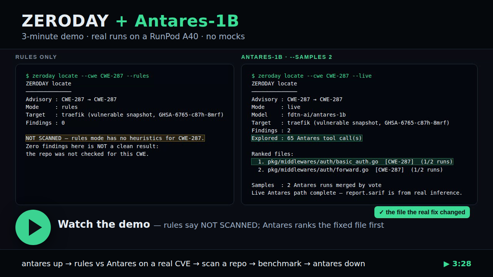
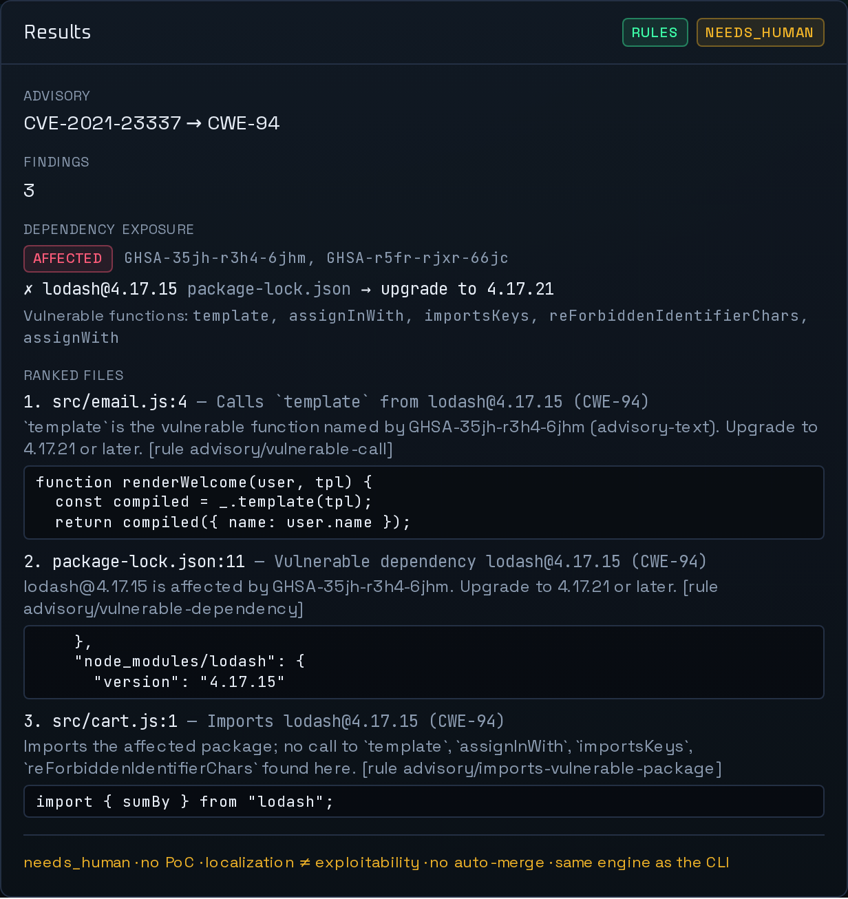

# ZERODAY

[](https://github.com/pandeyaby/ZERODAY/actions/workflows/zeroday-locate.yml)
[](https://www.npmjs.com/package/zeroday-cli)
[](https://codespaces.new/pandeyaby/ZERODAY)

**An advisory just landed — which files in your repo should a human look at first?**

Give ZERODAY a CWE, CVE or GHSA plus a repo you are authorized to assess. It
checks your lockfiles against the advisory, ranks the files a reviewer should
read first — with the line, the code and the reason — and writes standard
**SARIF** for GitHub Code Scanning, IDEs and SIEMs. It runs on your machine: no
API keys, no GPU, your source never leaves it.

For the weaknesses rules can't model — missing authorization, broken
authentication, ReDoS — one command starts
[Antares-1B](https://cisco-foundation-ai.github.io/antares/) on your own GPU
account, and `zeroday scan` puts both answers side by side.

<a href="#demo"></a>

<a id="demo"></a>▶ **The 3-minute demo** ([download MP4](./docs/media/zeroday-demo.mp4)) — every run in it is real:
`antares up` on a RunPod A40 (ready in 2 minutes), a real authentication-bypass
advisory, a scan of OWASP Juice Shop, and the benchmark. Total GPU cost: $0.53.

https://github.com/user-attachments/assets/abe2599a-498b-44f1-aa0e-84495c77ced5

| Fixed file ranked #1 · [36 real advisories, 3 runs each](./docs/antares-benchmark.md) | Hit@1 | Top 3 |
|---|---:|---:|
| ZERODAY rules alone | 14% | 19% |
| **Antares-1B, one run** | **25%** | **31%** |
| Antares-1B, two runs merged (`--samples 2`) | 28% | 35% |
| Antares-1B on the 4 weakness types rules can't scan (rules: 0%) | 14% | 22% |

Antares-1B's File F1 on these advisories is **0.233**, against 0.209 on its model card's own
benchmark; 35 of the 36 fixes postdate its training data. 95% intervals, the per-case results
and the comparison are in [`docs/antares-benchmark.md`](./docs/antares-benchmark.md). (The video
shows the first single pass, which put two merged runs at 36%; three passes settle at 28%.)

**How it decides.** By default there is no AI model involved: `--rules` parses
JavaScript/TypeScript, Python, Java and Go with tree-sitter and traces request
input to dangerous calls; advisory scans read public data from
[OSV](https://osv.dev) (only the advisory id is sent). A local model is optional
([Antares](https://cisco-foundation-ai.github.io/antares/) or any
OpenAI-compatible `/v1/completions` server) for CWEs the rules don't cover.

ZERODAY *localizes*; it does not prove bugs. Every result is a candidate for
human review.

> **Hard limits**
>
> - No PoCs, exploits, payloads, or attack procedures — ever
> - Localization ≠ proof of exploitability · `needs_human` always · never auto-merge
> - Keyless by default — no GPU, no HF token, no spend; a live model is opt-in and costs $
> - Your source stays local unless you explicitly allow remote inference (`--remote-inference`)
> - Scope: [`SCOPE_AND_AUTHORIZATION.md`](./SCOPE_AND_AUTHORIZATION.md) ·
>   disclosure: [`SECURITY.md`](./SECURITY.md) · help: [`SUPPORT.md`](./SUPPORT.md)

**Public OSS · Apache-2.0 · not a Cisco product.**

---

## Start in 2 minutes

Needs Node 20+ on macOS or Linux. Offline. No GPU, no HF token, no spend.

```bash
git clone https://github.com/pandeyaby/ZERODAY.git && cd ZERODAY
npm install
npm run mvp        # self-test on a bundled demo app → PASS + report.sarif
```

`npm run mvp` replays a recorded run (`--fixture`) to prove your setup works —
it does not read your code. Open the printed `report.sarif` under
`zeroday-reports/mvp/`, then point ZERODAY at your own repo.

**No clone needed:**

```bash
npx zeroday-cli mvp                                   # CLI only — or: npm i -g zeroday-cli → zeroday
npx zeroday-cli locate --cwe CWE-89 --repo . --rules --offline
docker run --rm -p 127.0.0.1:3000:3000 ghcr.io/pandeyaby/zeroday   # Desk web UI → http://localhost:3000
```

Releases are signed and ship SBOMs (keyless Sigstore, GitHub build provenance, CycloneDX / SPDX):
[`docs/verify-release.md`](./docs/verify-release.md).

### Scan your own repo (keyless)

```bash
npm run zeroday -- locate --cwe CWE-89 --repo /path/to/your/repo --rules --offline \
  --output zeroday-reports/my-scan
```

Example on a small Express + Python app:

```text
Mode     : rules
Findings : 3

Ranked files:
  1. src/search.js  [CWE-89]  SQL query built from dynamic input
  2. src/users.js   [CWE-89]  SQL query built from dynamic input
  3. src/search.py  [CWE-89]  SQL query built from dynamic input
```

`report.md` explains each one — for `src/users.js:4`: *Request input from line 3
(`req.query.name`) reaches this call.* Files where request input is traced to the
sink rank above values that are merely built at runtime (`src/search.py`).
Parameterized queries in the same app are not flagged.

### What it covers

| Mode | Flag | Advisories | You need |
|------|------|------------|----------|
| Rules (keyless analysis) | `--rules` | 10 CWEs, below — JS/TS, Python, Java, Go | Nothing |
| Import existing findings | `--from-sarif <file>` | Any CWE in a CodeQL / Semgrep / generic SARIF 2.1 file | A SARIF file |
| Scan for anything | `scan` | Every rules CWE, plus the CWEs Antares picks for your repo | Nothing (rules) · Antares for the rest |
| Live Antares | `--live` | Any CWE, CVE or GHSA | `antares up` (your RunPod account), or a local vLLM / Ollama / LM Studio — [below](#when-you-want-live-antares) |
| Demo | `--fixture` | Bundled CWE-89 demo | Nothing |

Rules mode parses JavaScript/TypeScript, Python, Java and Go into syntax trees
(tree-sitter, bundled — no native build) and traces request input through
assignments, string building, branches, collections and helper functions — in
the same file or imported from another — to dangerous calls:

| CWE | | CWE | |
|-----|--|-----|--|
| 89 | SQL injection | 502 | Unsafe deserialization |
| 79 | Cross-site scripting | 918 | Server-side request forgery |
| 22 | Path traversal | 611 | XML external entities |
| 78 | OS command injection | 798 | Hard-coded credentials |
| 94 | Code injection | 601 | Open redirect |

CWE-502 / 94 also cover ML model loading: `torch.load` without
`weights_only=True`, `numpy.load(allow_pickle=True)`, joblib / pickle model files,
Keras `safe_mode=False` and Hugging Face `trust_remote_code=True`.

Other languages (Ruby, PHP, C#) get line heuristics for CWE-89 / 79 / 22. Ask for
a CWE with no rules and it prints **NOT SCANNED** and exits `2` — it never reports
an unscanned CWE as clean.

**Measured accuracy** (high-confidence findings, [`docs/benchmark.md`](./docs/benchmark.md)):
OWASP Benchmark Java **57.7** (80% precision, 80% recall) and Python **53.7**
(81% precision, 62% recall), scored as true-positive rate − false-positive rate.
Reproduce with `npm run bench`.

### An advisory just landed: which files matter?

Give it a CVE or GHSA instead of a CWE. ZERODAY reads the advisory from
[OSV](https://osv.dev) (only the id is sent, never your code), checks the pinned
versions in your lockfiles (npm / yarn / pnpm, pip / Poetry / Pipfile / uv,
Go modules, Maven / Gradle) and ranks calls to the vulnerable functions first:

```text
$ npx zeroday-cli locate --cve CVE-2021-23337 --repo . --rules
Exposure : AFFECTED — GHSA-35jh-r3h4-6jhm, GHSA-r5fr-rjxr-66jc
           ✗ lodash@4.17.15  package-lock.json  → upgrade to 4.17.21
Functions: template, …

Ranked files:
  1. src/email.js       [CWE-94]  Calls `template` from lodash@4.17.15
  2. package-lock.json  [CWE-94]  Vulnerable dependency lodash@4.17.15
  3. src/cart.js        [CWE-94]  Imports lodash@4.17.15
```

A patched version reports *not affected*; a package you don't use reports *not
used*. `--offline` never fetches (a cached or mirrored advisory is still used).

### What you get

Every run writes one folder (default `zeroday-reports/<advisory>-<timestamp>/`, or `--output`):

| File | Use it for |
|------|------------|
| `report.sarif` | GitHub Code Scanning (`upload-sarif`), IDE SARIF viewers |
| `report.json` | Machine-readable result, format `zeroday.report/v1` — [JSON Schema](./docs/schemas/zeroday.report.v1.schema.json) |
| `report.md` | Human-readable ranked files with evidence lines |
| `comment.md` | Paste-ready pull-request comment |
| `evidence/manifest.json` | SHA-256 evidence vault — check with `npm run zeroday -- verify --from <dir>` |
| `*.json` / `*.ndjson` exports | AWS Security Hub (ASFF), Splunk CIM, Cortex XSOAR, FortiSIEM, CrowdStrike HEC |

**Exit codes:** `0` done · `1` candidates found with `--fail-on-findings` ·
`2` not scanned, incomplete live run, or error. The stable commands, flags,
output files and exit codes are listed in [`docs/stability.md`](./docs/stability.md)
([`CHANGELOG.md`](./CHANGELOG.md) for changes).

### In CI

Add the Action to any repository — it brings its own ZERODAY. On a pull request
it scans the files the PR changed, uploads SARIF to Code Scanning and posts a
reviewable comment:

```yaml
      - uses: actions/checkout@v4
        with: { fetch-depth: 0 }
      - uses: pandeyaby/ZERODAY/.github/actions/zeroday-locate-gate@v0.11.0
        with:
          mode: rules
          repo: .
          cwe: CWE-89
          changed-since: origin/${{ github.base_ref }}
          fail-on-findings: "true"
```

Adopting on an existing codebase? Commit a baseline `report.json` and pass
`baseline:` so only **new** findings fail the job. Full guide, matrix over CWEs
and the advisory workflow: [`docs/github-action.md`](./docs/github-action.md).
Org setup and spend gates: [`docs/org-ops-runbook.md`](./docs/org-ops-runbook.md).

---

## Desk (web UI)

The same scans in a browser:



```bash
npm run play
# → http://localhost:3333/play
```

Enter a repo path and a CWE, CVE or GHSA, then **Run locate --rules**: the
dependency verdict, the ranked files with code and reasons, and the report paths
appear side by side. Other tabs import SARIF, browse earlier reports, connect an
optional local model (**Live brain** — never runs without your confirmation) and
re-run the project's own checks (**Verify it yourself**).

The Desk answers on localhost only, refuses cross-site requests and keeps every
path inside the workspace; serving it to other machines needs a token —
[`docs/desk-security.md`](./docs/desk-security.md). Scan a folder outside this
checkout with `ZERODAY_UI_ROOTS=/path/to/repo npm run play`.

A 3-minute walkthrough (CLI, Desk and a pull request): [`docs/demo.md`](./docs/demo.md).

---

## Verify it yourself

Every run writes `evidence/manifest.json`; check that nothing changed since:

```bash
npm run zeroday -- verify --from zeroday-reports/mvp
npm run stranger:verify     # the project's own keyless checks (Prove doors) in one command
```

The trust material — reproducible fixtures, the **Prove doors** checks, CI gates,
dated GPU runs, and the optional [DIPTYCH](https://github.com/pandeyaby/DIPTYCH)
paired-probe calibration layer (`npm run paired-probe`) — is in
[`docs/trust.md`](./docs/trust.md). Honesty Q&A: [`docs/faq.md`](./docs/faq.md).

---

## When you want live Antares

[Antares](https://cisco-foundation-ai.github.io/antares/) is Cisco Foundation AI's
model for file-level vulnerability localization: it explores a repository with
`find` / `grep` / `cat` tool calls and submits the files it believes are
vulnerable, for **any** CWE. ZERODAY is the harness around it: a read-only
snapshot, a tool budget, fail-closed checks, SARIF / PR comment / evidence
hashes, and a human gate.

ZERODAY also makes Antares more useful with no extra setup:

- **Finds your server.** `locate --live` with no `--endpoint` uses the Desk's
  saved endpoint, or a local vLLM (:8000), Ollama (:11434) or LM Studio (:1234)
  that serves an Antares model — loopback only, `GET /v1/models` only.
- **Shows rules and Antares side by side.** ZERODAY's static pass runs on the
  same snapshot and the result marks which files **both** flagged, which only
  Antares found, and which rules candidates Antares did not confirm. On real
  advisories the two lists together catch more than either alone.
- **Can merge runs.** Antares-1B varies from run to run; `--samples 2` runs it
  twice and ranks files by votes. Over 3 passes on 36 real advisories that put
  the fixed file first in 28% of cases, against 25% for a single run — within
  the noise at this sample size — and 14% for the rules alone. (`--context`
  also sends the rules findings to Antares as starting context — it did not
  help there, so it is off by default.)

It is opt-in and **costs $**. One command starts it on your own RunPod
account — you accept the Hugging Face terms for
[`fdtn-ai/antares-1b`](https://huggingface.co/fdtn-ai/antares-1b) and export
`RUNPOD_API_KEY` + `HF_TOKEN` (read from the environment, never saved):

```bash
npm run zeroday -- antares up          # installs the Antares CLI, starts a Secure A40 (~$0.50/hr),
                                       # waits for the model, saves the endpoint; deleted after 30 min
npm run zeroday -- scan --repo /path/to/authorized/repo     # anything: rules + Antares-picked CWEs
npm run zeroday -- locate --cve CVE-2021-23337 --repo /path/to/authorized/repo --live
npm run zeroday -- antares down        # delete the pod now (status: antares status)
```

ZERODAY never downloads weights to your machine and **never creates paid RunPod
pods** unless you run `antares up` and confirm; every pod it creates has a
deadline and a watchdog that deletes it. Already serving Antares yourself
(vLLM / Ollama / LM Studio, or `docs/runpod-antares.md`)? `--live` finds it.
Non-loopback endpoints need `--remote-inference` (`antares up` sets it for the pod
it creates). **No silent fixture fallback** if the endpoint is down. Measured
accuracy on real advisories: [`docs/antares-benchmark.md`](./docs/antares-benchmark.md).

```bash
uv tool install cisco-antares-cli                     # the official Antares CLI (antares up does this)
npm run zeroday -- locate --cwe CWE-89 --repo /path/to/authorized/repo \
  --endpoint http://127.0.0.1:8000/v1 --model fdtn-ai/antares-1b   # explicit endpoint
npm run zeroday -- antares doctor          # print-only checklist, no spend
npm run zeroday -- doctor --local-brain    # any local OpenAI-compatible brain
# or: bash scripts/quickstart-live.sh /path/to/repo CWE-89
```

Arbitrary local models ≠ Antares File F1 — see
[`docs/local-brain.md`](./docs/local-brain.md). Install, HF access and RunPod
details: [`docs/paths.md`](./docs/paths.md#live-antares-opt-in) ·
[`docs/trust.md`](./docs/trust.md#when-you-want-live-antares-door-b--opt-in-gpu-brain) ·
[cookbook Quickstart](https://github.com/cisco-foundation-ai/cookbook/blob/main/1_quickstarts/Quickstart_Antares.md)

---

## Go deeper

| Want | Go here |
|------|---------|
| Demo video · 3-minute live demo script | [`docs/media/zeroday-demo.mp4`](./docs/media/zeroday-demo.mp4) · [`docs/demo.md`](./docs/demo.md) |
| Antares accuracy on real advisories | [`docs/antares-benchmark.md`](./docs/antares-benchmark.md) |
| GitHub Action guide | [`docs/github-action.md`](./docs/github-action.md) |
| Accuracy numbers and how they're measured | [`docs/benchmark.md`](./docs/benchmark.md) |
| Stable commands, outputs, exit codes, `report.json` schema | [`docs/stability.md`](./docs/stability.md) · [`CHANGELOG.md`](./CHANGELOG.md) |
| Verify a release (signatures, SBOMs) | [`docs/verify-release.md`](./docs/verify-release.md) |
| Every mode and flag | [`docs/paths.md`](./docs/paths.md) |
| Desk security model | [`docs/desk-security.md`](./docs/desk-security.md) |
| Trust, reproducibility, DIPTYCH | [`docs/trust.md`](./docs/trust.md) |
| Coding-agent operator path | [`docs/agent-operator.md`](./docs/agent-operator.md) |
| Docs index · FAQ | [`docs/README.md`](./docs/README.md) · [`docs/faq.md`](./docs/faq.md) |

---

## License & credits

**Apache-2.0** — see [`LICENSE`](./LICENSE) (`SPDX-License-Identifier: Apache-2.0`).
**Not a Cisco product**; not an official Cisco partnership. Authorized /
defensive use only ([`SCOPE_AND_AUTHORIZATION.md`](./SCOPE_AND_AUTHORIZATION.md)).
No warranty.

- **Antares** — [site](https://cisco-foundation-ai.github.io/antares/) ·
  [Quickstart](https://github.com/cisco-foundation-ai/cookbook/blob/main/1_quickstarts/Quickstart_Antares.md) ·
  [HF `fdtn-ai/antares-1b`](https://huggingface.co/fdtn-ai/antares-1b) ·
  [`cisco-antares-cli`](https://pypi.org/project/cisco-antares-cli/)
- **[DIPTYCH](https://github.com/pandeyaby/DIPTYCH)** — optional calibration grading
  (ZERODAY emits paired probes; DIPTYCH grades)
- Tree-sitter grammars in [`grammars/`](./grammars) (MIT) · advisory data from [OSV](https://osv.dev)
